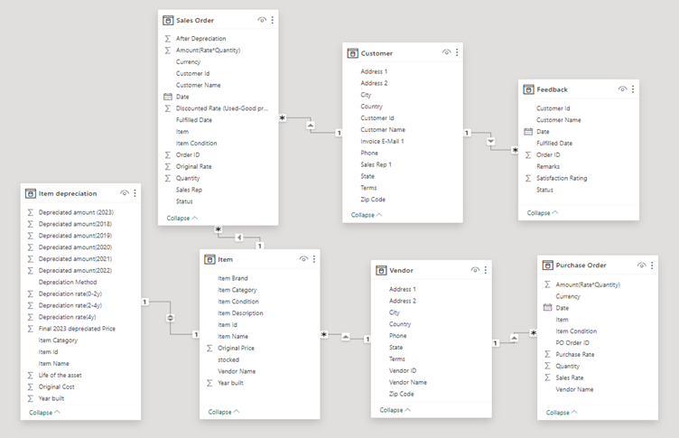

# Business-Analytics-on-Pineapple
The project aims to outline the comprehensive scope of our collaboration with Pineapple, aiming to expand its operations in North America within the resold electronic products market. We specialize in enabling seamless Customer Relationship Management (CRM) through Salesforce and enhancing data visualization capabilities using Power BI.

The analytical solution for Pineapple encompasses the entire programming infrastructure designed to analyze customer data and present insights to facilitate more informed decision-making in business operations. With the advent of new and quicker methods for engaging with customers, the significance of transforming the data gathered about customers into actionable information has become increasingly vital for businesses. 

### Customer Account Management: 
The resolution necessitates overseeing accounts, starting from generating leads and identifying opportunities, all the way through to completing sales. 

 

### Profitability analysis and Customer value: 
Analyzing customer relationship management (CRM) data can offer a perspective on Pineapple’s customers who consistently yield the greatest profits. This entails not only evaluating a customer’s expenditure but also considering the resources allocated to serve that customer.  

 

### Personalization: 
CRM platform would be effective in documenting and monitoring customer analytics, encompassing purchase records, demographic information, and interactions with customer service. This functionality empowers Pineapple to provide personalized services to both individual customers and specific customer segments via focused advertising efforts, resulting in increased levels of customer satisfaction. 

# Database Design

